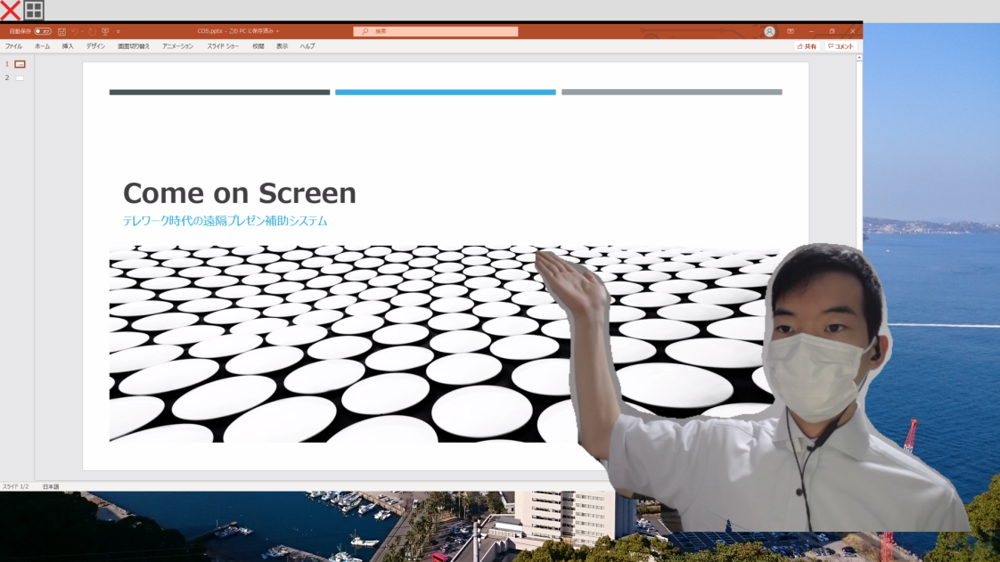

## Come on Screen

Come on Screen(カモンスクリーン)は、プレゼンテーションスライドと同時に、発表者の身振り手振りを伝えるためのプレゼンテーション支援ツールです。

### 使い方

- [マニュアル](./manual.md)

### Download

#### 最新版

- [Windows版 (version 3.0.0)](https://github.com/dendenlabo/comeonscreen-website/releases/download/v3.0.0/comeonscreen-v3.0.0-win32-x64.zip)
- [Mac版 (version 1.0.1)](https://github.com/dendenlabo/comeonscreen-website/releases/download/v1.0.1/comeonscreen-v1.0.1-darwin-x64.zip)

### 動作環境

Windows 10での動作を確認しています。Zoomのバーチャル背景が使えないスペックのPCでも動作しますが、発熱や故障などは自己責任でお願いします。特に指先などの認識のためには、AIカメラの設定を”高”にする必要がありますが、dGPUがないマシンだと厳しいです。

### 注意点

- 本ソフトウェアの使用によって生じたいかなる損害についても、製作者は責任を負いかねます。 
- 本ソフトウェアの再配布，リバースエンジニアリングを禁止します。
-  本ソフトウェアの著作権は、dendenlaboに帰属します。

### 連絡先

バグ報告やフィードバック等ありましたらご連絡いただければ幸いです。

[Twitter](https://twitter.com/dendenlabo)

[URL](https://dendenlabo.github.io/comeonscreen-website/)

メール: dendenlabo@gmail.com
