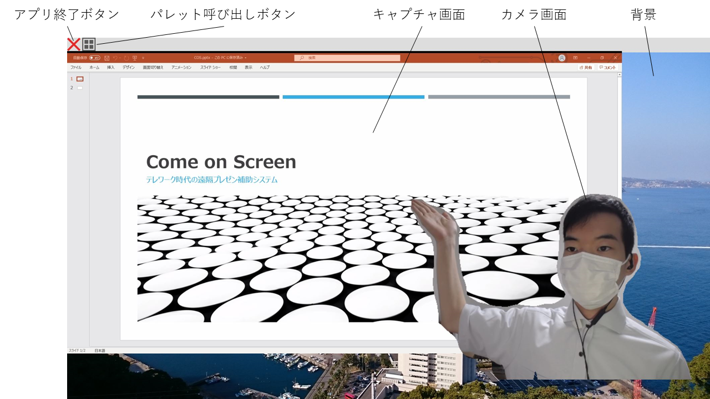
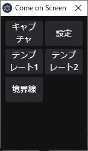
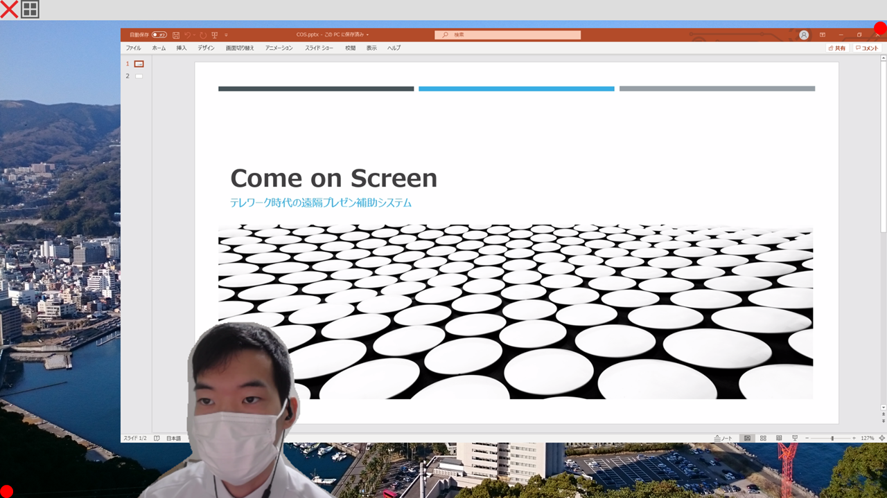
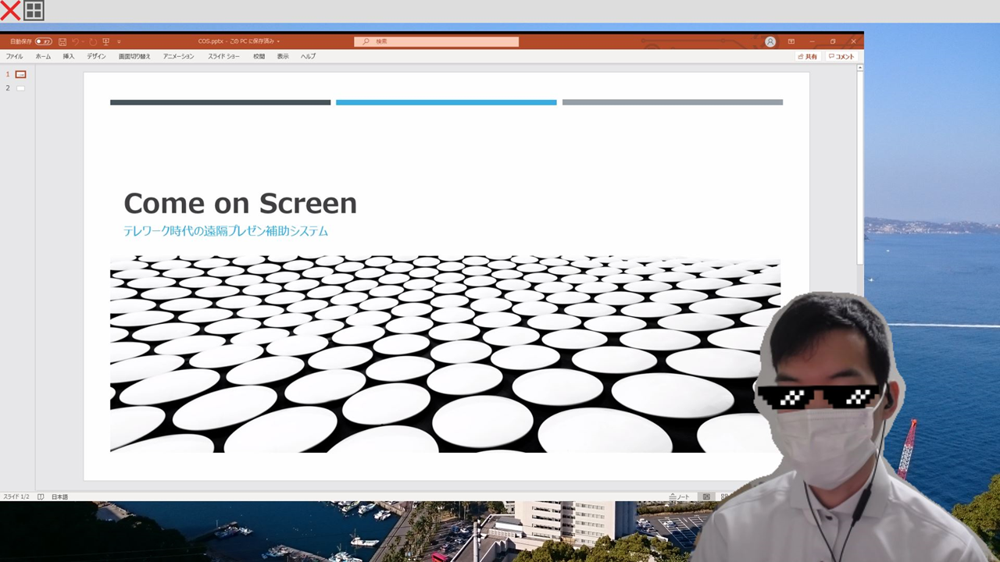

## 使用方法

1.  zipファイルを任意の場所に解凍する。
2.  解凍したフォルダ内の「comeonscreen.exe」を起動する。
3.  キャプチャ画面をパレットから選び，メインウインドウ内で自由に配置する。
4.  Zoomなどの画面共有機能を用いて「Come on Screen」を共有する。

## 画面説明

##### 「Come on Screen」はメインウインドウとパレットウインドウから構成されています。

#### メインウインドウ

画面共有時にシェアする画面です。カメラ画像やキャプチャ画面を自由に移動・拡大縮小できます。

移動にはドラッグ&ドロップ、拡大縮小にはセンターホイールを用いてください。

パレット呼び出しボタンをクリックすることで、各種設定などを行えるパレットウインドウが呼び出されます。

#### パレットウインドウ

各種設定の変更や目玉機能であるテンプレートを使う際に用いるウインドウです。

それでは各ボタンの説明をします。

- キャプチャ：スクリーンシェアする対象となるウインドウを選択します。対象となるウインドウがタスクバーに格納されている場合は、リストに出てこないので注意してください。
- 設定：カメラデバイスの選択やパフォーマンス・背景画像の設定などを行う画面が表示されます。
- テンプレート：予め設定された配置にウインドウを瞬時に移動します。テンプレートの編集機能は今後搭載する予定です。詳細は後述。
- 境界線：カメラ画面とキャプチャ画面の境目を表示するテスト機能です。基本的には使いません。

## テンプレート機能

「Come on Screen」の目玉機能の一つです。テンプレートボタンをクリックすると各画面があらかじめ設定しておいた場所に移動します。(v1.0.0ではテンプレートカスタマイズ機能は実装されていません。)

テンプレート1の場合を説明します。

キャプチャ画面が右上、カメラ画面が左上に設定されます。テンプレートには拡大縮小の中心となる点(赤丸)が設定されており、そちらに向けて拡大縮小が行われます。

## TIPS

カメラ入力にSnap Camera等を選択することもできます。

## 動作環境

Windows 10での動作を確認しています。Zoomのバーチャル背景が使えないスペックのPCでも動作しますが、発熱や故障などは自己責任でお願いします。特に指先などの認識のためには、AIカメラの設定を”高”にする必要がありますが、dGPUがないマシンだと厳しいです。

## 注意点

- 本ソフトウェアの使用によって生じたいかなる損害についても、製作者は責任を負いかねます。 
- 本ソフトウェアの再配布，リバースエンジニアリングを禁止します。
-  本ソフトウェアの著作権は、dendenlaboに帰属します。

## 連絡先

バグ報告やフィードバック等ありましたらご連絡いただければ幸いです。

Twitter: https://twitter.com/dendenlabo 

メール: dendenlabo@gmail.com

最新版: https://dendenlabo.booth.pm/items/2251960

